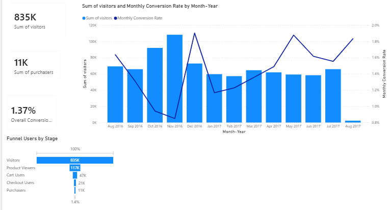
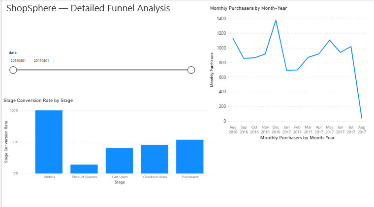
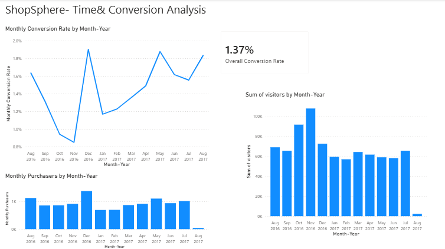
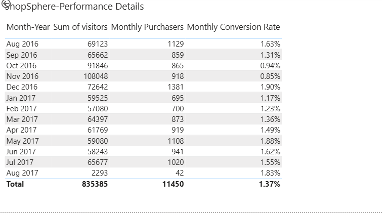

# ShopSphere E-Commerce Funnel Analysis

An end-to-end e-commerce analytics project analyzing customer acquisition, engagement, conversion, revenue, and user behavior using SQL, Google BigQuery, Python, Pandas, and Power BI.

The project transforms Google Analytics sample e-commerce data into business-focused insights across the complete customer journey — from visitors and product engagement to cart, checkout, and purchase.

---

## 📊 Project Snapshot

| KPI | Result |
|---|---:|
| Unique Visitors | ~835K |
| Purchasers | ~11K |
| Overall Conversion Rate | 1.37% |
| Product Viewers | ~117K |
| Cart Users | ~47K |
| Checkout Users | ~21K |

The underlying analysis reports 835,385 unique visitors and 11,450 purchasers, resulting in an overall conversion rate of 1.37%.

The analysis focuses on understanding where users drop out of the purchase journey and where conversion optimization opportunities exist.

---

## 📌 Project Overview

E-commerce businesses generate large volumes of behavioral and transaction data, but raw data alone does not explain where customers are being lost or which segments drive performance.

This project analyzes the ShopSphere e-commerce dataset to answer questions such as:

- How efficiently are visitors moving through the purchase funnel?
- Where are the largest conversion drop-offs?
- Which countries contribute the most revenue?
- How does performance vary across devices?
- Which marketing channels and traffic sources generate valuable traffic?
- Which pages attract the most users?
- How does conversion rate change over time?
- What areas of the customer journey could be optimized?

---

## 🎯 Business Objectives

1. Measure overall e-commerce performance.
2. Analyze the customer conversion funnel.
3. Identify major funnel drop-off points.
4. Compare revenue across countries.
5. Compare performance across devices.
6. Evaluate marketing channels and traffic sources.
7. Analyze landing pages and viewed pages.
8. Identify time-based conversion patterns.
9. Build an interactive Power BI dashboard.
10. Translate analytical results into business recommendations.

---

## 🛠️ Tools & Technologies

| Tool | Purpose |
|---|---|
| Google BigQuery / SQL | Data querying, transformation, aggregation, and analysis |
| Python | Exploratory analysis and validation |
| Pandas | Data manipulation and processing |
| Google Colab / Jupyter Notebook | Python analysis |
| Power BI | Interactive dashboard and visualization |
| GitHub | Project documentation and portfolio |

---

## 📂 Data Source

The project uses the Google Analytics sample e-commerce dataset available through Google BigQuery.

The dataset contains session-level information related to:

- Website sessions
- Visitors
- Page views
- Product interactions
- Transactions
- Revenue
- Traffic sources
- Marketing channels
- Devices
- Geographic information
- User behavior

### Important Data Consideration

The source data is session-oriented, meaning that a single visitor can appear across multiple sessions.

For visitor-level KPIs, the analysis therefore uses unique visitor identification rather than treating every session row as a separate visitor.

For example:

`sql
COUNT(DISTINCT fullVisitorId)
is used when calculating unique visitors.

This distinction is important because counting session rows directly would not represent the number of unique visitors.

---

## 🔎 Analytical Approach

The project follows an end-to-end analytical workflow:

Google Analytics Sample Data
            ↓
       Google BigQuery
            ↓
       SQL Analysis
            ↓
     Python / Pandas
            ↓
     Validation & Analysis
            ↓
        Power BI
            ↓
    Business Insights
            ↓
      Recommendations

The SQL analysis was divided into multiple business questions rather than relying on a single large query, making the analytical logic easier to understand, validate, and reuse.

---

# 📈 Key Business Insights

## 1. Overall conversion rate was 1.37%The analysis recorded:

- 835,385 unique visitors
- 11,450 purchasers
- 1.37% overall conversion rate

Only a small proportion of the visitor base progressed to a completed purchase.

This highlights why evaluating traffic volume alone is not sufficient for understanding e-commerce performance.

---

## 2. The largest funnel loss occurs before product engagement

The customer funnel analyzed the following stages:

Visitors
   ↓
Product Viewers
   ↓
Cart Users
   ↓
Checkout Users
   ↓
Purchasers

The dashboard displays approximately:

| Funnel Stage | Users |
|---|---:|
| Visitors | ~835K |
| Product Viewers | ~117K |
| Cart Users | ~47K |
| Checkout Users | ~21K |
| Purchasers | ~11K |

Approximately 14% of visitors progressed to the product-view stage, making the visitor-to-product stage the largest volume drop in the funnel.

This suggests that improving the early customer journey — including landing-page relevance, navigation, product discovery, and the transition from acquisition channels to product pages — could have significant downstream impact.

> Funnel-stage counts are displayed in rounded thousands in the Power BI dashboard, so stage-level conversion percentages are approximate.

---

## 3. Conversion improves once users enter the purchase journey

Using the displayed funnel values:

- Approximately 40% of product viewers progressed to the cart stage.
- Approximately 45% of cart users progressed to checkout.
- Approximately 52% of checkout users progressed to purchase.

This indicates that the largest volume loss occurs before product engagement rather than exclusively at checkout.

The funnel therefore provides a more useful diagnostic view than looking only at the final conversion rate.

---

## 4. December 2016 recorded the strongest monthly conversion rate

December 2016

- Visitors: 72,642
- Purchasers: 1,381
- Conversion Rate: 1.90%

December recorded the strongest monthly conversion performance in the dashboard.

This period can be used as a benchmark for investigating differences in:

- Customer intent
- Traffic composition
- Promotions
- Product demand
- Marketing activity
- Seasonal behavior

---

## 5. November 2016 recorded the weakest monthly conversion rate

November 2016

- Visitors: 108,048
- Conversion Rate: 0.85%

November had the highest visitor volume among the displayed monthly results but the lowest conversion rate.

This demonstrates that high traffic volume does not automatically translate into stronger commercial performance.

The finding reinforces the importance of evaluating acquisition quality using downstream metrics such as purchases, conversion rate, and revenue.

---

## 6. Traffic volume should be evaluated together with downstream performance

With approximately 835K visitors but only 11K purchasers, the project demonstrates why e-commerce performance should be evaluated across multiple stages of the customer journey rather than traffic volume alone.

Useful downstream metrics include:

- Product engagement
- Cart progression
- Checkout progression
- Purchases
- Conversion rate
- Revenue

---

# 🧩 Analysis Areas

## 1. Overall E-Commerce KPIs

Analyzed high-level performance indicators including:

- Unique visitors
- Purchasers
- Conversion rate
- Page views
- Transaction-related metrics
- Revenue-related metrics

These metrics provide a baseline view of the business before deeper segmentation.

---

## 2. E-Commerce Funnel Analysis

The customer journey was analyzed across:

Visitors → Product Viewers → Cart Users → Checkout Users → Purchasers

The analysis identifies where users are lost throughout the purchase journey and highlights potential areas for conversion optimization.

---

## 3. Funnel Conversion Rates

Conversion rates were analyzed between different stages of the customer journey, including:

- Visitor → Product View
- Product View → Cart
- Cart → Checkout
- Checkout → Purchase

This provides a stage-level view of customer behavior.

---

## 4. Revenue AnalysisRevenue was analyzed across multiple dimensions including:

- Country
- Device
- Marketing channel
- Traffic source
- Time period

The objective was to understand where commercial value is being generated rather than relying only on traffic volume.

---

## 5. Geographic Performance

Country-level analysis was used to investigate:

- Revenue distribution
- Visitor activity
- Geographic performance
- Differences in customer behavior
- Potential market opportunities

---

## 6. Device Performance

Performance was compared across:

- Desktop
- Mobile
- Tablet

Metrics analyzed include:

- Visitors
- Transactions/purchases
- Revenue
- Conversion behavior

Comparing devices can reveal potential differences in customer experience and conversion.

---

## 7. Marketing Channel Analysis

Marketing channels were analyzed using metrics such as:

- Traffic
- Transactions
- Revenue
- Conversion performance

The objective was to distinguish channels that generate large amounts of traffic from channels that generate meaningful downstream value.

---

## 8. Traffic Source Analysis

Traffic sources were analyzed to understand:

- Visitor acquisition
- Engagement
- Revenue contribution
- Conversion performance

This helps evaluate traffic quality rather than simply measuring traffic volume.

---

## 9. Page & Landing Page Performance

Website pages were analyzed to identify:

- Most viewed pages
- Landing-page performance
- Page engagement
- Potential high-traffic / low-conversion areas

These results can support website optimization decisions.

---

## 10. Time-Based Analysis

The project analyzes performance across:

- Month
- Hour of day
- Conversion rate
- Time-of-day behavior

The objective is to identify changes in customer activity and conversion behavior over time.

---

# 📊 Power BI Dashboard

The Power BI dashboard converts the analytical results into an interactive business reporting layer.

### Dashboard Coverage

- Overall e-commerce KPIs
- Visitor and purchaser performance
- Monthly conversion trends
- Funnel analysis
- Revenue analysis
- Geographic performance
- Device performance
- Marketing channel analysis
- Traffic source analysis
- Time-based performance

## Dashboard Preview

### Page 1 — Overall E-Commerce Overview

### Page 2 — E-Commerce Performance

### Page 3 — E-Commerce Analysis

### Page 4 — Detailed E-Commerce Analysis

---

# 💼 Business Recommendations

## 1. Improve Early Funnel Engagement

The largest volume loss occurs between visitors and product engagement.

Potential areas for investigation include:

- Landing-page relevance
- Product discovery
- Navigation
- Search experience
- Acquisition-to-product-page alignment

Improving this stage could increase the number of users entering the downstream purchase journey.

---

## 2. Investigate High-Performing Periods

December recorded a 1.90% conversion rate, compared with 0.85% in November.

The business could investigate what changed between these periods, including:

- Traffic mix
- Promotions
- Product demand
- Customer intent
- Marketing activity
- Seasonal effects

December can serve as a benchmark period for understanding what conditions are associated with stronger conversion.

---

## 3. Avoid Optimizing for Traffic Alone

November demonstrates that high traffic does not automatically translate into high conversion.

Marketing performance should therefore be evaluated using downstream metrics such as:

- Purchasers
- Conversion rate
- Revenue
- Customer value

rather than visitor volume alone.

---

## 4. Investigate Device-Level Differences

If meaningful conversion differences exist between desktop, mobile, and tablet users, the business should investigate potential UX or technical causes before allocating optimization resources.

Potential areas include:- Mobile navigation
- Page load performance
- Product discovery
- Checkout usability
- Form completion experience

---

## 5. Evaluate Acquisition Sources Using Commercial Outcomes

Marketing channels and traffic sources should be evaluated using a combination of:

- Traffic
- Conversion
- Purchases
- Revenue
- Engagement

This helps distinguish high-volume acquisition from high-value acquisition.

---

## 6. Prioritize Funnel-Level Optimization

Rather than treating the overall 1.37% conversion rate as the only problem, the business should prioritize the specific funnel stages where the greatest loss occurs.

The analysis indicates that the largest volume reduction occurs before product engagement, making the early customer journey an important area for further investigation.

---

# 🧪 Validation & Quality Checks

The project includes validation across the analytical workflow.

Key checks include:

- Verifying unique visitor calculations
- Checking aggregation levels
- Comparing analytical outputs with Power BI results
- Checking monthly calculations
- Validating chronological month sorting
- Reviewing funnel-stage calculations
- Checking dashboard KPI consistency

A key consideration throughout the project was avoiding incorrect aggregation caused by the session-level structure of the source data.

---

# ⚠️ Limitations

This project uses the Google Analytics sample e-commerce dataset, so the results should be interpreted as an analytical case study rather than live business performance.

Important limitations include:

- The dataset is a sample rather than production company data.
- Marketing spend and customer acquisition cost are not available.
- Profit margins and customer lifetime value are not included.
- Funnel metrics depend on the definitions established for this project.
- Observational analysis does not establish causality.
- A 1.37% conversion rate cannot be judged as good or bad without an appropriate benchmark.
- The analysis identifies patterns and opportunities but does not prove that a particular factor caused a conversion change.
- Funnel-stage figures displayed in the dashboard are rounded for presentation.

---

# 📁 Repository Structure

The repository contains a structured set of SQL analyses, Python/Pandas analysis, Power BI reporting, and project documentation.

The SQL analysis was consolidated by removing identical duplicate queries and renumbering the remaining analyses sequentially from 01 to 17.

ShopSphere-Ecommerce-Funnel-Analysis/
│
├── 01_overall_ecommerce_kpis.sql
├── 02_ecommerce_funnel_analysis.sql
├── 03_funnel_conversion_rates.sql
├── 04_revenue_by_country.sql
├── 05_revenue_by_device.sql
├── 06_revenue_by_marketing_channel.sql
├── 07_device_performance_analysis.sql
├── 08_geographic_performance.sql
├── 09_hourly_conversion_rate_analysis.sql
├── 10_landing_page_performance.sql
├── 11_page_performance_analysis.sql
├── 12_revenue_transaction_performance.sql
├── 13_shopsphere_daily_ecommerce_dataset.sql
├── 14_time_of_day_performance_analysis.sql
├── 15_top_viewed_pages.sql
├── 16_traffic_source_engagement_revenue.sql
├── 17_traffic_source_performance.sql
│
├── ShopSphere_Ecommerce_Analytics.ipynb
├── Shopsphere_Ecommerce_funnel.pbix
│
├── page-1-overview.png
├── page-2-overview.png
├── page-3-overview.png
├── page-4-overview.png
│
└── README.md

---

# 📚 SQL Analysis Coverage

| Analysis | File |
|---|---|
| Overall E-Commerce KPIs | 01_overall_ecommerce_kpis.sql |
| E-Commerce Funnel | 02_ecommerce_funnel_analysis.sql |
| Funnel Conversion Rates | 03_funnel_conversion_rates.sql |
| Revenue by Country | 04_revenue_by_country.sql |
| Revenue by Device | 05_revenue_by_device.sql |
| Revenue by Marketing Channel | 06_revenue_by_marketing_channel.sql |
| Device Performance | 07_device_performance_analysis.sql || Geographic Performance | 08_geographic_performance.sql |
| Hourly Conversion Rate | 09_hourly_conversion_rate_analysis.sql |
| Landing Page Performance | 10_landing_page_performance.sql |
| Page Performance | 11_page_performance_analysis.sql |
| Revenue / Transaction Performance | 12_revenue_transaction_performance.sql |
| ShopSphere Daily Dataset | 13_shopsphere_daily_ecommerce_dataset.sql |
| Time-of-Day Performance | 14_time_of_day_performance_analysis.sql |
| Top Viewed Pages | 15_top_viewed_pages.sql |
| Traffic Source Engagement & Revenue | 16_traffic_source_engagement_revenue.sql |
| Traffic Source Performance | 17_traffic_source_performance.sql |

---

# 🧠 Skills Demonstrated

## Data Analysis

- Exploratory Data Analysis
- KPI development
- Funnel analysis
- Segmentation
- Time-series analysis
- Revenue analysis
- Customer behavior analysis

## SQL

- SELECT
- WHERE
- GROUP BY
- ORDER BY
- Aggregations
- COUNT(DISTINCT ...)
- Conditional logic
- Conversion calculations
- Time-based aggregation
- Business metric development

## Python / Pandas

- Data inspection
- Data cleaning
- Data manipulation
- Aggregation
- Exploratory analysis
- Analytical validation

## Power BI

- KPI cards
- Funnel visualization
- Time-series analysis
- Interactive reporting
- DAX measures
- Date sorting
- Dashboard design
- Business storytelling

## Business Analytics

- Conversion optimization
- Customer journey analysis
- Revenue analysis
- Acquisition analysis
- Performance segmentation
- Business recommendations

---

# 🔄 End-to-End Workflow

1. Source Data
2. BigQuery
3. SQL Analysis
4. Python / Pandas
5. Validation
6. Power BI
7. Business Insights
8. Recommendations

The project demonstrates how raw behavioral data can be transformed into decision-oriented business intelligence.

---

# 🚀 Future Improvements

If additional production-style data were available, the project could be extended with:

- Marketing spend and CAC analysis
- Customer Lifetime Value
- Cohort retention analysis
- Product-level profitability
- A/B testing analysis
- Customer segmentation
- Predictive conversion modeling
- Funnel anomaly detection
- Automated dashboard refresh
- Real-time e-commerce monitoring

---

# 👤 Project Author

Ajay

This project was developed as part of a portfolio focused on:

Data Analytics • FinTech • Business Intelligence • Risk Analytics

---

# ⭐ Project Summary

ShopSphere E-Commerce Funnel Analysis demonstrates an end-to-end analytical workflow using BigQuery, SQL, Python, Pandas, and Power BI to investigate customer behavior and e-commerce conversion.

The analysis starts with approximately 835K unique visitors, identifies how users progress through the purchase funnel, and evaluates where the largest opportunities for conversion improvement exist.

The final result combines:

SQL + Python + Business Analysis + Power BI + Data Storytelling
